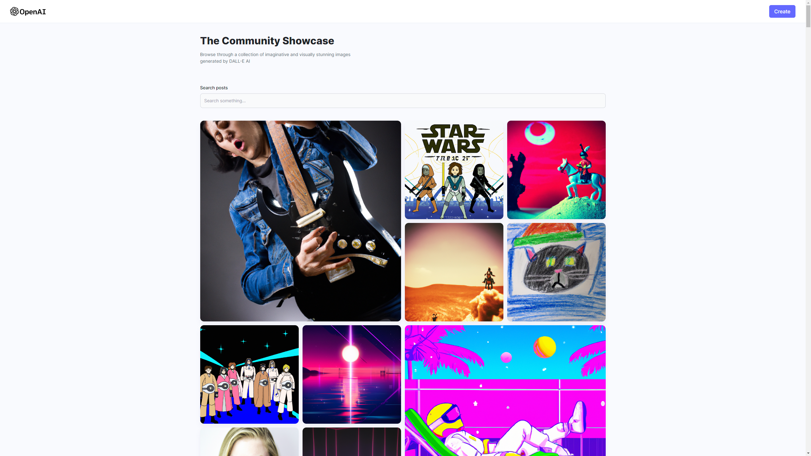

# IMAGE GENERATOR APP WITH OPEN_AI API

## TOOLS

-FrontEnd: [ReactJS](https://reactjs.org/)
-BackEnd: [NodeJS](https://nodejs.org/en/)
-NeuralEngine:[OpenAi](https://openai.com/)
-DataBase: [MongoDB](https://www.mongodb.com/)
-Cloud-base image/video management service: [Cloudinary](https://cloudinary.com/)

